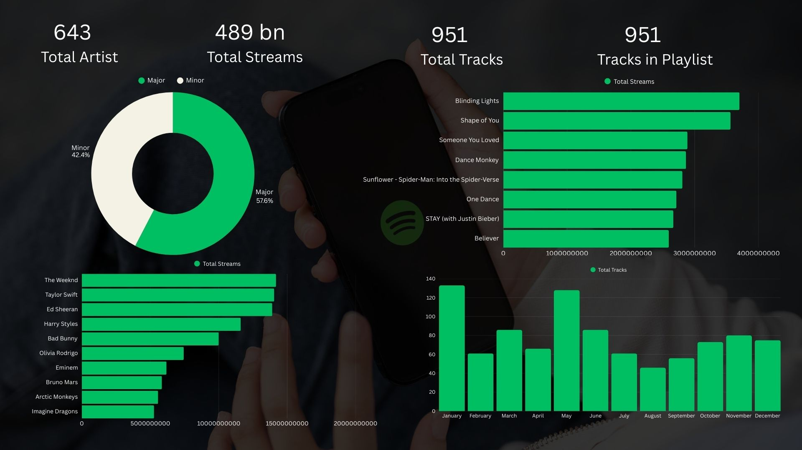

# Spotify Power BI Dashboard

Interactive dashboard analyzing Spotify streaming data.

## Features
- Total streams, artists, tracks
- Monthly trends
- Top artists & songs

## How to View
1. Download `spotify_dashboard.pbix`.
2. Open in [Power BI Desktop](https://powerbi.microsoft.com/desktop/).

